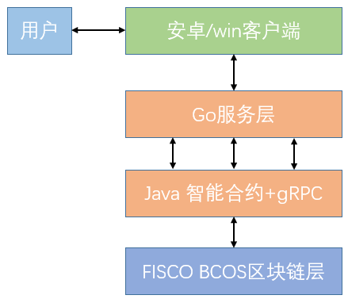

# 媒体素材--项目架构

`DT`是繁星数据平台区块链合约`java`调用端，为服务器端提供数据上链服务。

## 相关工具：

- [gRPC框架](https://grpc.io/) 

  进程间通信服务，GRPC 是谷歌开源的一个高性能、跨语言的 RPC 框架，基于 HTTP2 、Protobuf 和 `Netty 4.x` ; 
  使用方法方法可参考：
  [Go GRPC使用](https://www.wingsxdu.com/?p=1204)、 [Java GRPC proto 编译]( https://www.wingsxdu.com/?p=1216)、 [Java Grpc 工程中使用]( https://www.wingsxdu.com/?p=1227)

## 目录结构

其项目架构图如下图所示：




- `src`：主要工作区
  * `java`(主程序)
    - `fisco`:区块链智能合约的Java调用代码
    - `grpc`:和Go语音交互的代码
  * `proto`：gRPC的`proto`文件
  * resources(配置文件)
    - contract：区块链合约存放目录
    - 证书、签名文件、配置等

## 部署流程

### 1. 区块链层

1.1 部署合约：

```shell
[group:1]> deploy CopyrightDemo 
contract address: 0x17acfb54a3c64227a983ed54c4763424f06b8a9e
```

1.2 编译智能合约，获得Java class：

```shell
# 切换到fisco/console/目录
$ cd ~/fisco/console/
# 编译合约，后面指定一个Java的包名参数，可以根据实际项目路径指定包名
$ ./sol2java.sh org.fisco.bcos.fisco
```

### 2. 智能合约

2.1 将`org.fisco.bcos.fisco`下的`class`文件拷贝到项目中，编写调用程序。

2.2 编译`proto文件`

#### gRPC系列之Java服务端

##### 1. `proto`文件定义

使用 protocol buffers 接口定义语言来定义服务方法，用 protocol buffer 来定义参数和返回类型。客户端和服务端均使用服务定义生成的接口代码。

实现一个`sayHello`方法,`proto`文件编写如下：

```go
syntax = "proto3";

package proto;

service HelloService {
    rpc SayHello (HelloRequest) returns (HelloResponse);
}
  
message HelloRequest {
    string greeting = 1;
}
  
message HelloResponse {
    string reply = 1;
}
```

##### 2. gRPC-JAVA的环境配置

参照https://github.com/grpc/grpc-java 步骤进行配置：

1. 使用`pom.xml`，下载gRPC插件：

```xml
		<!--Grpc-->
        <dependency>
            <groupId>io.grpc</groupId>
            <artifactId>grpc-netty-shaded</artifactId>
            <version>1.24.0</version>
        </dependency>
        <dependency>
            <groupId>io.grpc</graoupId>
            <artifactId>grpc-protobuf</artifactId>
            <version>1.24.0</version>
        </dependency>
        <dependency>
            <groupId>io.grpc</groupId>
            <artifactId>grpc-stub</artifactId>
            <version>1.24.0</version>
        </dependency>
```

2. 添加插件：

```xml
			<plugin>
                <groupId>org.xolstice.maven.plugins</groupId>
                <artifactId>protobuf-maven-plugin</artifactId>
                <version>0.6.1</version>
                <!--添加.proto文件的编译工具-->
                <configuration>
                    <protocArtifact>com.google.protobuf:protoc:3.10.0:exe:${os.detected.classifier}</protocArtifact>
                    <pluginId>grpc-java</pluginId>
                    <pluginArtifact>io.grpc:protoc-gen-grpc-java:1.24.0:exe:${os.detected.classifier}</pluginArtifact>
                </configuration>
                <executions>
                    <!--这是上面两个编译工具用到的命令-->
                    <execution>
                        <goals>
                            <goal>compile</goal>
                            <goal>compile-custom</goal>
                        </goals>
                    </execution>
                </executions>
            </plugin>
```

完整的`pom.xml`文件是这样的： https://github.com/grpc/grpc-java/blob/master/examples/pom.xml 

3. 编译成`java`文件

按照这个官方文档的说明， 需要把之前创建的`helloworld.proto`放到项目里，不能随便放，有默认位置，在`src/main/`下新建`proto`文件夹，并把`helloworld.proto`放进去。 

在控制台输入` mvn compile`。会在`target`下生产一堆文件，在`target/generated-sources/protobuf/java` 和`grpc-java`下会生成我们需要的文件 ，如图所示：


##### 3. 编写Java的服务端

参考[官方文档](https://github.com/grpc/grpc-java)，编写其服务端，gRPC-Java的服务端：

首先创建一个服务端处理消息的类，实现我们服务定义的生成的服务接口，做我们的服务的实际的“工作”。

```java
	/**
     * 创建客户的grpc
     */
    static class CreateUserImpl extends CreateUserGrpc.CreateUserImplBase {
        @Override
        public void createUser(CopyrightDemo.CreateUserRequest request, StreamObserver<CopyrightDemo.CreateUserResponse> responseObserver) {
           //这个super.sayHello()如果不注释掉的话，会一直提示说，方法没有实现
           //super.createUser(request, responseObserver);

            System.out.println("===========CreateUserImpl=============");

            System.out.println(request.getUserPhone());
            boolean code = false;
            try {
                if (CopyrightDemoBlockServer.CreateUser(BigInteger.valueOf(request.getUserPhone()), request.getDate()) == 1) {
                    code = true;
                }
            } catch (Exception e) {
                e.printStackTrace();
            }

            CopyrightDemo.CreateUserResponse response = CopyrightDemo.CreateUserResponse.newBuilder().setResult(code).build();
            responseObserver.onNext(response);
            responseObserver.onCompleted();

        }
    }    
```

`@Override`快捷键：`CTRL+O`

----

这里注意一个很坑的地方，就是在继承父类的时候，使用快捷键`ctrl+o`，实现父类方法时，会带有`super.sayHello(request, responseObserver);`

**注意，要把这个注释掉，不然客户端会报错，说没有实现父类的方法。**

### 3.编译，部署到云上

3.1 利用`moven`插件,将文件打包成`jar`文件

3.2 部署到云服务器：（`linux`命令）

```shell
##根据端口port查进程：
lsof  -i:port     
##查找特定的进程
ps -ef|grep ssh
##不挂断运行命令,当账户退出或终端关闭时,程序仍然运行，所有输出被重定向到Log.log的文件中
nohup java -jar XXX.jar > Log.log & 
或者
nohup java -jar XXX.jar >> Log.log &
```


